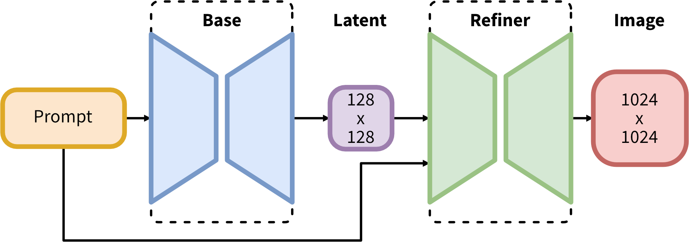

# SDXL 模型推理指南

## 概述

本文档介绍在 Enflame GCU 上基于 pytorch native 进行 stable‐diffusion‐xl‐base‐1.0 的 text2image 任务的推理及性能评估过程

## 模型说明

SDXL是一个两阶段的级联扩散模型（Latent Diffusion Model），包括 Base 模型和 Refiner 模型。其中 Base 模型的主要工作和 SD-1.5、SD-2.0、SD-2.1 等模型一致，具备文生图（txt2img）、图生图（img2img）、图像 inpainting 等能力。在 Base 模型之后，级联了 Refiner 模型，对 Base 模型生成的图像 Latent 特征进行精细化提升，其本质上是在做图生图的工作。

SDXL Base 模型由两个 CLIP（Text Encoder）、U-Net、VAE 三个模块组成，SDXL Refiner 模型由一个 CLIP(Text Encoder)、 U-Net、VAE 三个模块组成。


* 图片来源：[stabilityai/stable-diffusion-xl-base-1.0](https://huggingface.co/stabilityai/stable-diffusion-xl-base-1.0)

相比 SD 1.x-2.x, SDXL 无论是对不同子模块（U-Net、VAE、CLIP Text Encoder）还是对模型的整体工作流程都做了大幅的改进，能够生成 1024x1024 及以上分辨率的高质量图片。这些改进思想无论是对 AIGC 时代的模型还是传统深度学习时代的模型，都有巨大的迁移应用价值。

## 环境配置

以下步骤基于 `Python3.10`, 请先安装所需依赖：

* 安装环境：安装过程请参考《TopsRider 软件栈安装手册》，请根据手册完成 TopsRider 软件栈安装

- 安装 fast-diffusers

  ```bash
  # 需要使用 root 权限
  ./TopsRider_{filename}.run -y -C fast-diffusers
  ```

- 安装依赖

  进入 sdxl 根目录，执行：

  ```bash
  pip3 install -r requirements.txt
  ```

## 准备模型

- 下载预训练模型：

  请从 [stable-diffusion-xl-base-1.0](https://huggingface.co/stabilityai/stable-diffusion-xl-base-1.0/tree/main) 路径下下载全部内容到模型存放目录，以下用

    `path_to_model_dir` 表示其路径

    - branch: `main`
    - commit id: `4621659`

## 执行推理

### Text2Image 推理

使用 sdxl base 进行推理，进入 sdxl 根目录，执行以下命令：

``` bash
python3 demo_stable_diffusion_xl_base_txt2img.py \
--model_dir ${path_to_model_dir} \
--device 'gcu' \
--num_images_per_prompt 1 \
--prompt 'photo of an astronaut riding a horse on mars' \
--negative_prompt '' \
--seed 12345 \
--denoising_steps 30 \
--scheduler 'ddim' \
--guidance_scale 7.5 \
--image_height 1024 \
--image_width 1024 \
--output_dir './results/sdxl-base/text2img/demo'
```

其中，

* `--model_dir`: sdxl-base-1.0 的预训练模型所在的目录
* `--image_height`: 生成图片的高度
* `--image_width`: 生成图片的宽度
* `--scheduler`: 使用的调度器，当前支持ddim, pndm, dpm++_2m, ddpm, euler, euler_a, dpm_2m_karras
* `--denoising_steps`: 去噪步数
* `--output_dir`: 保存生成图片的路径

其它参数及其含义请使用以下命令查看：

``` bash
python3 demo_stable_diffusion_xl_base_txt2img.py -h
```

## 性能评估
### Text2Image 性能评估：

进入 sdxl 根目录，执行以下命令：

```bash
python3 benchmark_test_stable_diffuision_xl_txt2img.py \
--model_dir ${path_to_model_dir} \
--device 'gcu' \
--num_images_per_prompt 1 \
--prompt 'a beautiful photograph of Mt. Fuji during cherry blossom' \
--negative_prompt '' \
--seed 42 \
--denoising_steps 30 \
--scheduler 'dpm++_2m' \
--guidance_scale 5.0 \
--image_height 1024 \
--image_width 1024 \
--output_dir './results/sdxl-base/text2img/benchmark' \
--warmup_count 3 \
--eval_count 5
```

其中，

- `--model_dir`: 参数sdxl-base-1.0的预训练模型所在的目录
- `--prompt`: 正向提示词，可以传一个或多个，以单引号或双引号分隔，数量与negative_prompt相同
- `--negative_prompt`: 反向提示词，可以传一个或多个，以单引号或双引号分隔，数量与prompt相同
- `--image_height`: 生成图片的高度
- `--image_width`: 生成图片的宽度
- `--num_images_per_prompt`: 每个prompt生成图片的数量
- `--scheduler`: 使用的调度器，当前支持ddim, pndm, dpm++_2m, ddpm, euler, euler_a, dpm_2m_karras
- `--denoising_steps`: 去噪步数，默认为30
- `--output_dir`: 保存生成图片的路径
- `--warmup_count`: warmup次数
- `--eval_count`: 重复推理次数

其它参数及其含义请使用以下命令查看：

``` bash
python3 benchmark_test_stable_diffuision_xl_txt2img.py -h
```
