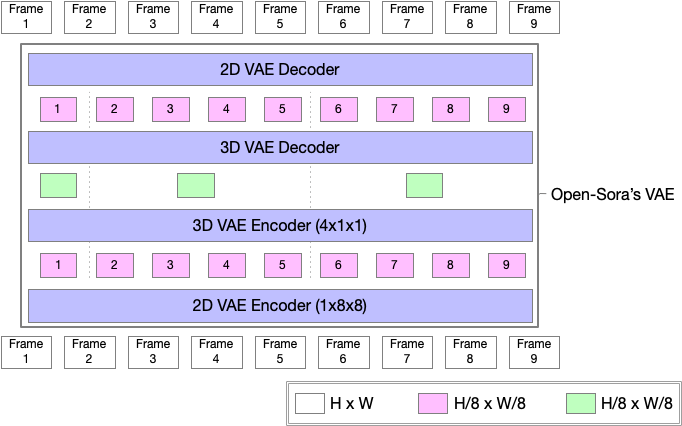

# OpenSora V1.2 模型推理指南

## 概述

本文档介绍在 Enflame GCU 上基于 pytorch native 进行 opensora_1.2 的 image2video 任务的推理及性能评估过程

## 模型说明

Open-Sora 1.2 在 720p 高清文生视频质量和生成时长上取得了突破性进展，支持无缝产出任意风格的高质量短片。其技术亮点包括：
- 视频压缩网络

  Open-Sora 团队提出了一个创新的视频压缩网络（VAE），该网络在空间和时间两个维度上分别进行压缩。首先在空间维度上进行 8x8 倍的压缩，接着在时间维度上进一步压缩了 4 倍。这种创新的压缩策略既避免了因抽帧而牺牲视频流畅度的弊端，又大幅降低了训练成本，实现了成本与质量的双重优化。

  
  * 图片来源：[report_v3.md](https://github.com/hpcaitech/Open-Sora/blob/main/docs/zh_CN/report_v3.md)

- 整流流和模型适应

  最新的扩散模型 Stable Diffusion 3 为了获得更好的性能，采用了rectified flow替代了 DDPM。可惜 SD3 的 rectified flow 训练代码没有开源。Open-Sora 1.2 实现了 SD3 论文中的训练策略，包括：
  * 基本整流流训练
  * 用于训练加速的 Logit-norm 采样
  * 分辨率和视频长度感知时间步长采样

  这些策略保留了原始模型生成高质量图像的能力，并未后续的视频生成提供了许多助力：

  * 通过整流，加速了模型训练，大幅减少了推理的等待时间。
  * 使用 qk-norm，训练更加稳定，并且可以使用积极的优化器。
  * 采用新的 VAE，时间维度压缩了4倍，使得训练更加高效。
  * 该模型具有多分辨率图像生成能力，可以生成不同分辨率的视频。

此外 Open-Sora 1.2 还采用了更多数据和更好的多阶段训练策略，设计了更好的评估指标，保障了模型的稳健性和泛化能力。

|      | 图像 | 2秒  | 4秒  | 8秒  | 16秒 |
| ---- | ----- | --- | --- | --- | --- |
| 240p | ✅     | ✅   | ✅   | ✅   | ✅   |
| 360p | ✅     | ✅   | ✅   | ✅   | ✅   |
| 480p | ✅     | ✅   | ✅   | ✅   | 🆗   |
| 720p | ✅     | ✅   | ✅   | 🆗   | 🆗   |

这里✅表示在训练期间可以看到数据，🆗表示虽然没有经过训练，但模型可以在该配置下进行推理。🆗的推理需要多个80G内存的GPU和序列并行。

Open-Sora 1.2 能够生成时长 16 秒、分辨率 720p 的高清视频，并支持生成各种风格的短片，例如海浪、森林、人物肖像、赛博朋克、动画等。此外，Open-Sora 1.2 还支持图像到视频的生成和视频扩展功能。

## 环境配置

以下步骤基于 `Python3.10`, 请先安装所需依赖：

* 安装环境：安装过程请参考《TopsRider 软件栈安装手册》，请根据手册完成 TopsRider 软件栈安装

- 安装 torch_gcu

  **注意**：安装 torch_gcu-2.3.0 会自动安装 torch 2.3.0

  ```bash
  # 需要使用 root 权限
  ./TopsRider_{filename}.run -y -C torch-gcu-2
  ```

- 安装依赖

  进入 opensora 根目录，执行：

  ```bash
  pip3 install -r requirements.txt
  ```

## 准备模型

* 下载预训练模型：

  请从 [OpenSora-STDiT-v3](https://huggingface.co/hpcai-tech/OpenSora-STDiT-v3/tree/main) 路径下下载全部内容到模型存放目录，以下用 `path_to_dit_dir` 表示其路径
  - branch: `main`
  - commit id: `9a8583918505ee93bd9fae8dd5ce32e1f9334c71`

  请从 [t5-v1_1-xxl](https://huggingface.co/DeepFloyd/t5-v1_1-xxl/tree/main) 路径下下载全部内容到模型存放目录，以下用 `path_to_t5_dir` 表示其路径
  - branch: `main`
  - commit id: `c9c625d2ec93667ec579ede125fd3811d1f81d37`

  请从 [pixart_sigma_sdxlvae_T5_diffusers](https://huggingface.co/PixArt-alpha/pixart_sigma_sdxlvae_T5_diffusers/tree/main) 路径下下载全部内容到模型存放目录，以下用 `path_to_vae2d_dir` 表示其路径
  - branch: `main`
  - commit id: `2c17b4e85261cd549b4068d086b7c2ba9d468e9f`

  请从 [OpenSora-VAE-v1.2](https://huggingface.co/hpcai-tech/OpenSora-VAE-v1.2/tree/main) 路径下下载全部内容到模型存放目录，以下用 `path_to_vae3d_dir` 表示其路径
  - branch: `main`
  - commit id: `33d153e9b5a9f771a8a84f98bd3f46458a8ed0bf`

## 执行推理

使用 opensora_1.2 进行推理，进入 opensora_1.2 根目录，执行：

``` bash
python3 demo_open_sora.py \
--device gcu \
--ckpt-path-dit $path_to_dit_dir \
--ckpt-path-t5 $path_to_t5_dir \
--ckpt-path-vae2d $path_to_vae2d_dir \
--ckpt-path-vae3d $path_to_vae3d_dir \
--num-frames 2s \
--resolution 144p \
--sample-name "2s-gcu-144p" \
--aspect-ratio 9:16 \
--prompt "a beautiful waterfall."
```

其中，

- `--ckpt-path-dit`: opensora dit 的预训练模型所在的目录
- `--ckpt-path-t5`: opensora t5_xxl 文本编码模型所在目录
- `--ckpt-path-vae2d`: opensora vae2d 的预训练模型所在的目录
- `--ckpt-path-vae3d`: opensora vae3d 的预训练模型所在的目录
- `--num-frames`: 生成视频的秒数，
- `--resolution`: 生成视频得分辨率
- `--aspect-ratio`: 生成视频的长宽比
- `--sample-name`: 保存生成的名字

其它参数及其含义请使用以下命令查看：

``` bash
python3 demo_open_sora.py -h
```


## 性能评估

对 opensora_1.2 144p 进行 image2video 性能评估，进入 opensora_1.2 根目录，执行：

```bash
python3 benchmark_open_sora.py \
--device gcu \
--ckpt-path-dit $path_to_dit_dir \
--ckpt-path-t5 $path_to_t5_dir \
--ckpt-path-vae2d $path_to_vae2d_dir \
--ckpt-path-vae3d $path_to_vae3d_dir \
--num-frames 2s \
--resolution 144p \
--sample-name "2s-gcu-144p" \
--aspect-ratio 9:16 \
--prompt "a beautiful waterfall." \
--benchmark-save-path './benchmark/report-opensora-v1.2.json' \
--warmup-count 3 \
--eval-count 5
```

其中，

- `--ckpt-path-dit`: opensora dit 的预训练模型所在的目录
- `--ckpt-path-t5`: opensora t5_xxl 文本编码模型所在目录
- `--ckpt-path-vae2d`: opensora vae2d 的预训练模型所在的目录
- `--ckpt-path-vae3d`: opensora vae3d 的预训练模型所在的目录
- `--num-frames`: 生成视频的秒数，
- `--resolution`: 生成视频得分辨率
- `--aspect-ratio`: 生成视频的长宽比
- `--sample-name`: 保存生成的名字

其它参数及其含义请使用以下命令查看：

``` bash
python3 benchmark_open_sora.py -h
```
