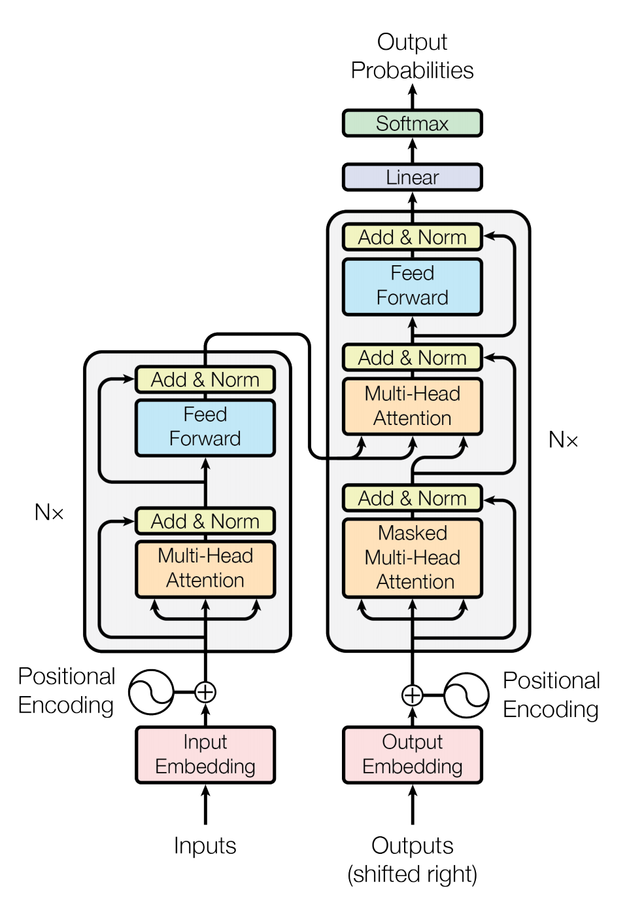

# <span id="transformer-for-pytorch">**Transformer模型**</span>

本代码仓库参考了[repo](https://github.com/NVIDIA/DeepLearningExamples/tree/master/PyTorch/Translation/Transformer)的实现， 在燧原科技第二代训练卡GCU上完成测试。


## <span id="table-of-contents">**目录**</span>
- [Transformer](#transformer-for-pytorch)
  - [**目录**](#table-of-contents)
  - [**模型介绍**](#model-introduction)
    - [**模型结构**](#model-architecture)
    - [**模型规模**](#default-configuration)
  - [**环境配置**](#environment-setup)
  - [**快速开始**](#start-guide)
    - [**准备训练数据集**](#prepare-dataset)
    - [**准备预训练模型文件**](#prepare-init-checkpoint)
    - [**数据集合**](#collect-all-data)
    - [**开始训练**](#start-fine-tuning-with-the-squad-dataset)
      - [**举例**](#run-bash-examlple)
  - [**结果**](#performance)
    - [**测试命令**](#training-performance-benchmark)
    - [**GCU测试结果**](#gcu-results)
      - [**训练精度**](#training-accuracy-results)
      - [**训练性能**](#training-performance-results)

## <span id="model-introduction">**模型介绍**</span>

本模型基于论文 [Attention Is All You Need](https://arxiv.org/abs/1706.03762) 实现.

### <span id="model-architecture">**模型结构**</span>

Transformer可以说也是NLP领域的里程碑式的工作，目前流行的NLP领域的bert，gpt，甚至图像和语音领域的基础结构都包含transformer层。Transformer的核心思想是注意力机制，包含了encoder和decoder两部分，encoder层和decoder层堆叠而成。

<p align="center">
    
    <br>
    Figure 1. Transformer 结构.
</p>

### <span id="default-configuration">**模型规模**</span>
[Transformer](https://arxiv.org/abs/1706.03762)一文中提及了两种不同规模的Transformer模型，模型的参数如下.
| **Model** | **Hidden layers** | **Hidden unit size** | **Attention heads** | **Feedforward filter size** | **Max sequence length** | **Parameters** |
|:---------:|:----------:|:----:|:---:|:--------:|:---:|:----:|
|transformer-base |12 encoder| 512| 8|2048|512|62M|
|transformer-large|24 encoder|1024| 16|4096|512|211M|

## <span id="environment-setup">**环境配置**</span>

安装配置好GCU驱动和SDK后，本repo模型的其它依赖pip安装即可，如下所示：

    ```bash
    pip install -r requirements.txt
    ```
## <span id="start-guide">**快速开始**</span>

这部分主要内容为如何训练Transformer模型，任务为翻译任务，数据集为[WMT14](https://statmt.org/wmt14/translation-task.html#Download)翻译任务的英德翻译数据集.

### <span id="prepare-dataset">**准备训练数据集**</span>

squad数据下载地址如下:

-   [WMT14 en-de](<https://data.deepai.org/WMT14_en-de.zip>)

下载并用命令unzip解压, 解压文件复制到$DATA_PATH目录。


### <span id="Collect all data">**数据集合**</span>

在上述的数据目录$DATA_PATH中内容如下：

```data
.
└── wmt14_en_de_joined_dict
    ├── code
    ├── dict.de.txt
    ├── dict.en.txt
    ├── test.en-de.de.bin
    ├── test.en-de.de.idx
    ├── test.en-de.en.bin
    ├── test.en-de.en.idx
    ├── test.raw.de
    ├── train.en-de.de.bin
    ├── train.en-de.de.idx
    ├── train.en-de.en.bin
    ├── train.en-de.en.idx
    ├── valid.en-de.de.bin
    ├── valid.en-de.de.idx
    ├── valid.en-de.en.bin
    ├── valid.en-de.en.idx
    └── valid.raw.de
```


#### <span id="run-bash-examlple">**举例**</span>
- 在GCU中跑训练squad任务运行脚本:

  ```bash
  bash scripts/run_1gcu_test.sh
  ```
- 注意事项:
  ```note
  1. 在run_squad_1gcu.sh中DATA_PATH变量替换为自己的路径。
  2. 如果想使用混精增加参数--amp即可，其它更多参数设置参考fairseq/options.py。
  ```

## <span id="performance">**结果**</span>


## <span id="training-performance-benchmark">**测试命令**</span>

测试脚本如下：

- 对于单卡GCU测试脚本.

  ```bash
  bash scripts/run_1gcu.sh
  ```

- 对于8卡GCU测试脚本.

  ```bash
  bash scripts/run_8gcu.sh
  ```
数据类型为FP32，不开混精。
## <span id="GCU-results">**GCU测试结果**</span>

### <span id="training-accuracy-results">**训练精度**</span>

- 单卡GCU-T20精度测试结果.

| **Epochs** | **Batch Size** | **BLEU** |
| ---------- | -------------- | ------------------- |
| 3          | 144             | 25.5                |

- 8卡GCU-T20精度测试结果.

| **Epochs** | **Batch Size/GCU** | **BLEU** |
| ---------- | ------------------ | ------------------- |
| 3          | 144                  | 25.6              |


### <span id="training-performance-results">**训练性能**</span>

- 单卡GCU-T20性能测试结果.

| **Batch Size/GCU** |**Throughput（sentence/s）** |
| -------------- | --------------------- |
| 144             |277                    |


- 8卡GCU-T20性能测试结果.

| **Batch Size/GCU** |  **Throughput（sentence/s）** |
| ------------------ |  --------------------- |
| 144                 |  1936               |
