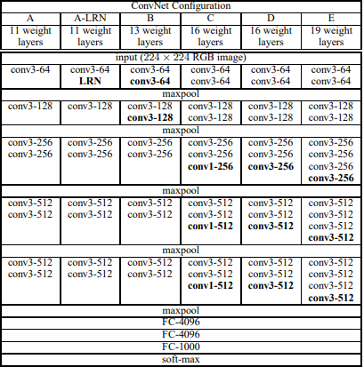

# <span id="vgg-for-pytorch">**VGG模型**</span>

本代码仓库参考了[repo](https://github.com/pytorch/vision/tree/main/references/classification)的实现， 在燧原科技第二代训练卡GCU上完成测试。


## <span id="table-of-contents">**目录**</span>
- [VGG](#vgg-for-pytorch)
  - [**目录**](#table-of-contents)
  - [**模型介绍**](#model-introduction)
    - [**模型结构**](#model-architecture)
    - [**模型规模**](#default-configuration)
  - [**环境配置**](#environment-setup)
  - [**快速开始**](#start-guide)
    - [**准备训练数据集**](#prepare-dataset)
    - [**开始训练**](#start-pretraining-with-the-imagnet-dataset)
      - [**举例**](#run-bash-examlple)
  - [**结果**](#performance)
    - [**测试命令**](#training-performance-benchmark)
    - [**GCU测试结果**](#gcu-results)
      - [**训练精度**](#training-accuracy-results)

## <span id="model-introduction">**模型介绍**</span>

本模型基于论文 [Very Deep Convolutional Networks for Large-Scale Image Recognition](https://arxiv.org/pdf/1409.1556.pdf) 实现.

### <span id="model-architecture">**模型结构**</span>

VGG是具有多层的标准深度卷积神经网络架构。“深”是指由16和19个卷积层组成的VGG-16或VGG-19的层数。VGG架构是突破性的对象识别模型的基础。作为深度神经网络开发的VGGNet在ImageNet之外的许多任务和数据集上也超越了基线。

### <span id="default-configuration">**模型规模**</span>


## <span id="environment-setup">**环境配置**</span>

安装配置好GCU驱动和SDK后，本repo模型的其它依赖pip安装即可，如下所示：

    ```bash
    pip install -r requirements.txt
    ```
## <span id="start-guide">**快速开始**</span>


### <span id="prepare-dataset">**准备训练数据集**</span>

ImageNet千分类数据下载地址如下:

-   [ImageNet](<http://www.image-net.org/download>)
```data
.
├── train
│   ├── n09399592
│   ├── n07880968
│   └── ...
├── val
│   ├── n07753275
│   ├── n09246464
│   └── ...
├── train_list.txt
└── val_list.txt
```


### <span id="start-pretraining-with-the-imagnet-dataset">**开始训练**</span>

#### <span id="run-bash-examlple">**举例**</span>
- 在GCU中单卡性能测试脚本:

  ```bash
  python -u ./train.py
    --device=gcu
    --data-path=imagenet_raw
    --batch-size=192
    --num_classes=1000
    --epochs=1
    --model=vgg16
    --workers=8
    --training_step_per_epoch=300
    --eval_step_per_epoch=300
    --dropout_rate=0.0
    --lr=0.01
    --print-freq=20
    --skip_steps=5
  ```
- 注意事项:
  ```note
  1. --data-path路径改为imagnet_raw数据集所在路径
  2. export ENFLAME_ENABLE_TF32=true 表示数据类型为TF32, 设置false时数据类型为FP32。
  3. 如果想使用混精增加参数--amp即可，其它更多参数设置参考train.py。
  ```

## <span id="performance">**结果**</span>


## <span id="training-performance-benchmark">**测试命令**</span>

测试脚本如下：

- 对于单卡GCU测试性能

  ```bash
  python -u ./train.py
    --device=gcu
    --data-path=imagenet_raw
    --batch-size=192
    --num_classes=1000
    --epochs=1
    --model=vgg16
    --workers=8
    --training_step_per_epoch=300
    --eval_step_per_epoch=300
    --dropout_rate=0.0
    --lr=0.01
    --print-freq=20
    --skip_steps=5
  ```

- 对于8卡GCU测试性能

  ```bash
  python -u -m torch.distributed.launch --nproc_per_node=8 --master_addr=127.0.0.1 \
      --master_port=34568 --use_env train.py \
      --device=gcu
      --data-path=imagenet_raw
      --batch-size=192
      --num_classes=1000
      --epochs=1
      --model=vgg16
      --workers=8
      --training_step_per_epoch=300
      --eval_step_per_epoch=300
      --dropout_rate=0.0
      --lr=0.01
      --print-freq=20
      --skip_steps=5
  ```

- 对于单卡GCU测试收敛

  ```bash
  python -u ./train.py
    --device=gcu
    --data-path=imagenet_raw
    --batch-size=192
    --num_classes=1000
    --epochs=90
    --model=vgg16
    --workers=8
    --training_step_per_epoch=-1
    --eval_step_per_epoch=-1
    --dropout_rate=0.5
    --lr=0.01
    --print-freq=20
    --skip_steps=5
  ```

- 对于8卡GCU测试收敛

  ```bash
  python -u -m torch.distributed.launch --nproc_per_node=8 --master_addr=127.0.0.1 \
      --master_port=34568 --use_env train.py \
      --device=gcu
      --data-path=imagenet_raw
      --batch-size=192
      --num_classes=1000
      --epochs=90
      --model=vgg16
      --workers=8
      --training_step_per_epoch=-1
      --eval_step_per_epoch=-1
      --dropout_rate=0.5
      --lr=0.01
      --print-freq=20
      --skip_steps=5
  ```

数据类型为FP32，不开混精。
## <span id="gcu-results">**GCU测试结果**</span>

### <span id="training-accuracy-results">**训练精度**</span>

- 单卡GCU-T20精度测试结果.

| **Epochs** | **Batch Size** | **Accuracy** |
| ---------- | -------------- | ------------------- |
| 90          | 192             | 71.3                |

- 8卡GCU-T20精度测试结果.

| **Epochs** | **Batch Size/GCU** | **Accuracy** |
| ---------- | ------------------ | ------------------- |
| 90          | 192                  | 71.3             |