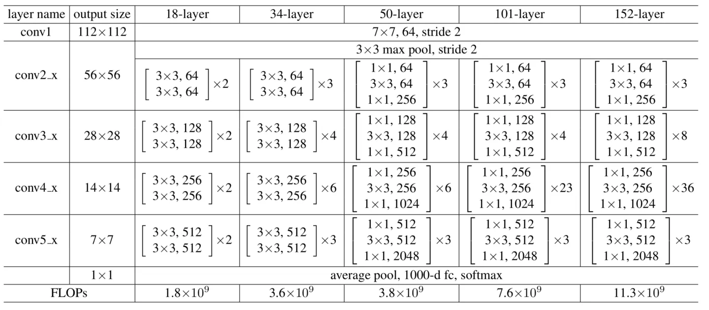
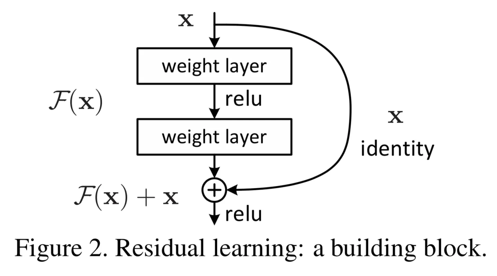

# ResNet-50 v1.5 for Tensorflow
This repository provides comprehensive ResNet-50 v1.5 model introduction and script recipe to train model for state-of-the-art performance, tested and maintained by Enflame.

## **Table Of Contents**
- [ResNet-50 v1.5 for Tensorflow](#resnet-50-v15-for-tensorflow)
  - [**Table Of Contents**](#table-of-contents)
  - [**Model Introduction**](#model-introduction)
    - [**Model Architecture**](#model-architecture)
    - [**Configuration**](#configuration)
      - [**Optimizer**](#optimizer)
      - [**Pre-Processing**](#pre-processing)
      - [**Post-Processing**](#post-processing)
  - [**Environment Setup**](#environment-setup)
    - [**Environment Setup On GCU**](#environment-setup-on-gcu)
  - [**Start Guide**](#start-guide)
    - [**Prepare Dataset**](#prepare-dataset)
    - [**Start Training**](#start-training)
  - [**Performance**](#performance)
    - [**Benchmarking**](#benchmarking)
      - [**Training Performance Benchmark**](#training-performance-benchmark)
    - [**GCU Results On T20**](#gcu-results-on-t20)
      - [**Training Accuracy Results**](#training-accuracy-results)
      - [**Training Performance Results**](#training-performance-results)
    - [**GPU Results**](#gpu-results)
      - [**Training Accuracy Results**](#training-accuracy-results-1)
      - [**Training Performance Results**](#training-performance-results-1)

## <span id="model-introduction">**Model Introduction**</span>

### <span id="model-architecture">**Model Architecture**</span>
The Resnet-50 v1.5 model is modified version of [original Resnet-50 v1 model](https://arxiv.org/abs/1512.03385), the Resent series models' architecture is shown below.

<div align=center>

</div>

And more specific blocks of the Resnet v1 model are shown below.

<div align=center>

</div>

The difference between Resnet-50 v1.5 model and Resnet-50 v1 model is in the blocks. More detail, in Resnet-50 v1.5 model's blocks, 1x1 convolution layers haven't been removed but modified to have a stride of 1 instead of 2. Meanwhile, the 3x3 convolution layers have been modified to have a stride of 2 instead of 1. In summary, the downsample responsibility has been transferred from first 1x1 convolution layer to the 3x3 convolution layer of bottleneck blocks.

The following tabel lists the basic information of the Resnet-50 v1.5

| **Layout** | **Input Shape**  | **Dynamic**  | **#Param** |
| ---------- | ---------------- | ------------ | ---------- |
| NHWC       | bsx224x224x3     | no           | ≈90M       |

### <span id="configuration">**Configuration**</span>
The default configuration for [Optimizer](#optimizer), [Pre-Processing](#pre-processing) and [Post-Processing](#post-processing) will be highlighted in this section.

#### <span id="optimizer">**Optimizer**</span>
The Resnet-50 v1.5 model uses the **Momentum** as default optimizer whih the following hyperparameters.
- **learning_rate**: use the `piecewise_constant` strategy that specify a leraning rate over a range based on the global_step, and the strategy takes global_step=`tf.train.get_or_create_global_step()`, boundaries=`[30, 60, 80, 90]` and values(that get according to the initial_learning_rate and decay_rates) as parameters.
- **momentum**: use the default value (0.9).
- **use_nesterov**: False, that do not use Nesterov accelerated gradient.

#### <span id="pre-processing">**Pre-Processing**</span>
To enable the Resnet-50 v1.5 model, we use [ImageNet 1k](https://www.image-net.org/) in TFRecord form.

- For Training
    - Random crop and flip use `sample_distorted_bounding_box`.
        - Min_object_covered=0.1.
        - Aspect ratio from 75% to 133%.
        - Area range from 5% to 100%.
    - Resize images to 224x224x3.
        - method=ResizeMethod.BILINEAR.
        - align_corners=False.
        - preserve_aspect_ratio=False.
    - Normalization.
        - Only subtracts the given means=[123.68, 116.779, 103.939] from each image channel.

#### <span id="post-processing">**Post-Processing**</span>

The output of the Resnet-50 v1.5 is the logits value generated by the final dense layer, and the shape is the same as the ground truth labels, which is [batch_size, num_classes], To obtain specific categories, the following post-processing is required：

- **`Softmax`**: convert logits into a set of probabilites that sum to 1 via `tf.nn.softmax(logits)`.
- **`Argmax`**: get the index of maximum probability via `tf.argmax(tf.nn.softmax(logits), axis=1)`.

## <span id="environment-setup">**Environment Setup**</span>

This section lists the environmental requirements for GCU and GPU enabling the Resnet-50 model respectively.

### <span id="environment-setup-on-GCU">**Environment Setup On GCU**</span>

1. Basic setup to enable Resnet-50 model.

   - Some dependencies are alse required listed in requirements.txt.

     ```bash
     pip install -r requirements.txt
     ```

---
## <span id="start-guide">**Start Guide**</span>
This section will cover more detail how to enabel models in GCU and GPU from scratch respectively, that including but not limited clone source code, prepare dataset, build environment, start training and inference. "dtu" and "_dtu" in the source code refer to gcu.

### <span id="prepare-dataset">**Prepare Dataset**</span>
The training and inference of Resnet-50 v1.5 model is based on ImageNet 1K a widely popular image classification dataset from the [ILSVRC challenge](https://www.image-net.org/challenges/LSVRC/).
1. Download the [ImageNet 1K](https://www.image-net.org/)
2. Extract the training and validation data:

    ```bash
    mkdir train && mv ILSVRC2012_img_train.tar train/ && cd train
    tar -xvf ILSVRC2012_img_train.tar && rm -f ILSVRC2012_img_train.tar
    find . -name "*.tar" | while read NAME ; do mkdir -p "${NAME%.tar}"; tar -xvf "${NAME}" -C "${NAME%.tar}"; rm -f "${NAME}"; done
    cd ..
    mkdir val && mv ILSVRC2012_img_val.tar val/ && cd val && tar -xvf ILSVRC2012_img_val.tar
    ```
3. Preprocess dataset to TFRecord format using [scrip](https://github.com/tensorflow/models/blob/archive/research/inception/inception/data/build_imagenet_data.py).

```text
dataset
   ├── imagenet
        ├── train
        │   ├── train-00352-of-01024
        │   ……
        ├── evaluate
        ……
        └── label.txt
```

**Notice**:
- Raw images should be converted to TFRecord format with `enflame_resnet/data_utils/make_imagenet.py`.
- Generated filename should be named as `train-xxxxx-of-xxxxxx`.
- Make sure datasets for:
    - training are located under `./dataset/imagenet/train`.
    - evaluate are located under `./dataset/imagenet/evaluate`.
    - inference are located under `./dataset/imagenet/test`.

### <span id="start-training">**Start Training**</span>
The `run_classify.py` is the main function that can be executed by python2 or python3, and there are several frequently used options you can specify, as listed below.

- **data_dir**: path to dataset.
- **is_training**: true for training while false for inference.
- **device**: device to running models, option: cpu, dtu, gpu.
- **dataset**: dataset name for training, inference and evaluation.
- **dtype**: floating-point format, option: fp32, bf16(not supported on cpu).
- **data_format**: format of feature data, option: NHWC, CHNW (only supported on GCU).
- **resnet_version**: which version of Resnet, optional: 1|1.5|2|3, 3 is slim model.
- **depth**: depth of resnet model, default 50 is RN50.
- **batch**_size: batch size.
- **epoch**: number of epochs to run for training the model.
- **display_step**: number of every steps to display loss.
- **num_between_eval**: number of epochs between two cye of evaluate.
- **num_between_saver**: number of epochs between two saving points.
- **optimizer**: which optimizer for training.
- **enable_evaluate**: when set to true, enable evaluating while training.
- **enable_saver**: when set to true, save checkpoints snapshot while training.
- **optimizer**: optimizer for training process.

More detail options, please see description are in `./utils/flag.py`.

```shell
./
├── data_utils
│     ├── data_processing.py
│     └── make_cifar.py
│     └── make_imagenet.py
│     └── make_imagenet2.py
│     └── md5.py
│
├── models
│     ├── resnet_model.py
│     └── resnet.py
│
├── utils_test
│     ├── data_processing_test.py
│     └── resnet_learning_rate_test.py
│     └── resnet_optimizer_test.py
│
├── utils
│      ├── flags.py
│      └── learning_rate.py
│      └── loss.py
│      └── network.py
│      └── optimizer.py
│
├── dataset
│      ├── imagenet
│           ├── train
│           │   ├── train-00352-of-01024
│           │   ……
│           ├── evaluate
│           ……
│           └── label.txt
│
├──classifier_main.py
│
├──README.md
│
├──requirements.txt
│
└──run_classify.py
```

---
## <span id="performance">**Performance**</span>

### <span id="benchmarking">**Benchmarking**</span>

#### <span id="training-performance-benchmark">**Training Performance Benchmark**</span>
To benchmark the training performance benchmark on a spcific batch size, run command:
- For 1 [GCU | GPU] and [FP32].

    ```bash
    source script/env.sh && python run_classify.py \
                --is_training=True \
                --device=<[dtu|gpu]> \
                --depth=50 \
                --dtype=<[fp32]> \
                --data_format=NHWC \
                --data_dir=./dataset/imagenet \
                --dataset=imagenet \
                --batch_size=<batch_size> \
                --epoch=90 \
                --resnet_version=1.5 \
                --enable_saver=True \
                --enable_evaluate=True \
                --optimizer=momentum
    ```
- For multiple [GCU | GPU] and [FP32].

    ```bash
    source script/env.sh && mpirun -np <chip numbers> --allow-run-as-root python run_classify.py \
                --is_training=True \
                --device=<[dtu|gpu]> \
                --depth=50 \
                --dtype=<[fp32]> \
                --data_format=NHWC \
                --data_dir=./dataset/imagenet \
                --dataset=imagenet \
                --batch_size=<batch_size> \
                --epoch=90 \
                --resnet_version=1.5 \
                --enable_saver=True \
                --enable_evaluate=True \
                --optimizer=momentum \
                --enable_horovod=True
    ```
- notice
    ```note
    1. change DATA_PATH to your own path.
    2. in env.sh ENFLAME_ENABLE_TF32=true means will use TF32 as the datatype, otherwise FP32 if set false.
    3. The model checkpoint file will located at `./models/checkpoints`, and can visualize by TensorBoard.
        ```bash
        tensorboard --logdir /models/tensorboard
        ```

### <span id="gcu-results on T20">**GCU Results On T20**</span>

#### <span id="training-accuracy-results">**Training Accuracy Results**</span>
- Training accuracy(top1) for 1 GCU under different dtype with fixed batchsize.

    Our results were obtrained by runing the [Training Performance Benchmark](#training-performance-benchmark) on Enflame 1xGCU.

    | **Epochs** | **Batch Size**          | **Accuracy - TF32**  |
    | ---------- | ----------------------- | -------------------- |
    | 90         | 128(TF32)               | 76.26                |

- Training accuracy(top1) multiple GCU under different dtype with fixed batchsize.

    Our results were obtrained by runing the [Training Performance Benchmark](#training-performance-benchmark) on Enflame 8xGCU.

    | **Epochs** | **Batch Size/GCU**      | **Accuracy - TF32** |
    | ---------- | ----------------------- | ------------------- |
    | 90         | 128(TF32)               | 76.3                |


#### <span id="training-performance-results">**Training Performance Results**</span>
- Training performance(Throughput) for  GCU under different dtype with various batch size.

    Our results were obtrained by runing the [Training Performance Benchmark](#training-performance-benchmark) on Enfalme GCU. Performance(images per second) were average over an entire training epoch.

    | **Batch Size** | **Throughput - TF32**  |
    | -------------- | ---------------------- |
    | 128            | 584.8836814            |

