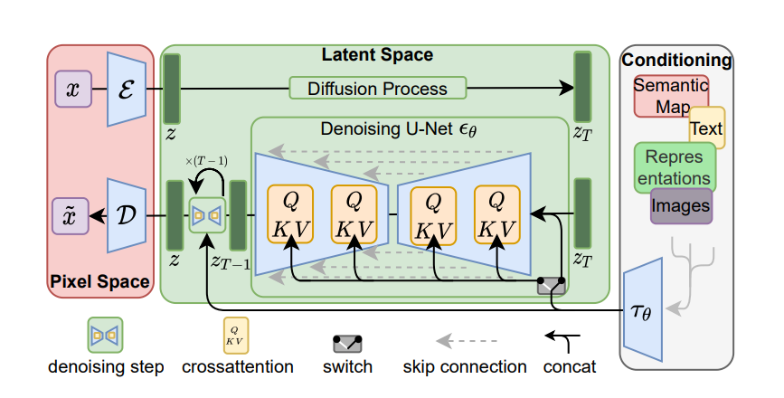

 Diffusers text_to_image sd2.0 base sft 训练教程

## 模型说明
Stable diffusion 包括 text encoder, U-Net, vae三个模型部分。text encoder将prompt进行编码，作为condition输入u-net的cross attention部分。vae包含encoder decoder部分，在训练与推理过程扮演不同角色。U-net作为diffusion model过程的主体参与diffusion部分的训练与推理过程。整体过程参考下图：

* 图片来源：[High-Resolution Image Synthesis with Latent Diffusion Models](https://arxiv.org/pdf/2112.10752).

## 环境准备

* 根据《TopsRider用户使用手册》安装TopsRider软件栈
  * 软件栈安装推荐使用 HOST+Docker 形式。用户下载的 TopsInstaller 安装包中提供了 Dockerfile ，用户可在 Host OS 中完成 Docker image 的编译，详细操作参考《TopsRider用户使用手册》附录部分，完成环境的安装
  * 在使用过程中，已经默认安装了PyTorch、PaddlePaddle、Tensorflow、tops_models等框架或相关依赖
* 如代码目录下存在requirements.txt文件，请按照requirements.txt中所示安装相应的依赖库

* 完成安装后，进行运行测试。
```
import torch_gcu
torch_gcu.is_available()
```
输入上述命令，在终端输出True，则表示安装成功。
```
True
```


##  数据和模型准备：

### 数据准备
从huggingface官方下载pokemon数据集。

* 下载地址：
   https://huggingface.co/datasets/lambdalabs/pokemon-blip-captions

### 模型准备
从huggingface官方下载stable-diffusion-v2-0-base模型。

* 下载地址：
   https://huggingface.co/stabilityai/stable-diffusion-2-base


## 模型训练

详细参数解释如下

```
accelerate launch: 使用huggingface的accelerate方式启动训练。
   --mixed_precision="fp16": 在accelerate中启动半精度。
   --multi_gcu: 使用分布式训练。
   --num_processes=8: 使用8卡训练。
   --num_machines=1: 使用一个节点。
   ./train_text_to_image.py: 要运行的 Python 训练脚本的文件路径

   --mixed_precision=fp16: 启动半精度训练。
   --train_batch_size=4: 每次训练的批量大小为 4。
   --max_train_steps=3000: 总共进行 3000个step的训练。
   --learning_rate=1.2e-5: 初始学习率为1.2e-5。
   --lr_scheduler='constant': 学习率的调度方式，这里是使用常量学习率。
   --lr_warmup_steps=0: 学习率warmup步数，这里0代表不进行warmup。
   --use_sdp: 是否使用GCU上开发的scaled_dot_production算子来减少HBM占用，这里代表启用。
   --resolution=512: 训练图片分辨率，这里是512*512。
   --center_crop: 训练数据增强方式，这里使用中心裁剪。
   --random_flip: 训练数据增强方式，这里使用随机水平翻转。
   --gradient_accumulation_steps=1: 梯度累积步数，这里1为每步都梯度更新。
   --max_grad_norm=1: 梯度裁剪的最大梯度范数为1。
   --logging_dir=tensorboard: tensorboard的log保存目录，这里保存到./tensorboard下
   --checkpointing_steps=10000000000: checkpoint保存间隔，这里设置很大，只有最后一步会保存。
   --skip_steps=10: 性能统计的时候跳过速度最慢的10步。
   --pretrained_model_name_or_path=pokemon/stable_diffusion_2_base: 预训练模型路径，指向文件夹。
   --dataset_name=pokemon/pokemon_blip_captions: 数据集路径，指向文件夹
   --validation_prompt='a corgi': 验证的时候使用的prompt，生成的图片会写入tensorboard中。
   --validation_epochs=50: 验证的步数间隔为50.
   --output_dir=./output: 输出保存的目录。

```


### 分布式训练

```bash
# 请如下添加环境变量，将accelerate和diffusers的src添加到pythonpath中
export PYTHONPATH=$PYTHONPATH:../../src/accelerate/src:../../src

accelerate  launch  --mixed_precision="fp16" --multi_gcu --num_processes=8 --num_machines=1 ./train_text_to_image.py \
    --mixed_precision=fp16 \
    --train_batch_size=4 \
    --max_train_steps=3000 \
    --learning_rate=1.2e-05 \
    --lr_scheduler="constant" \
    --lr_warmup_steps=0 \
    --use_sdp \
    --resolution=512 \
    --center_crop \
    --random_flip \
    --gradient_accumulation_steps=1 \
    --max_grad_norm=1 \
    --logging_dir=tensorboard \
    --checkpointing_steps=10000000000 \
    --validation_prompts='a corgi' \
    --validation_epochs=50 \
    --pretrained_model_name_or_path=pokemon/stable_diffusion_2_base \
    --dataset_name=pokemon/pokemon_blip_captions \
    --output_dir=./output > ${LOG_FILE} 2>&1

```


## 训练结果
下面是8卡分布式训练的report：
   ```
{
    "model": "xxxx_text_to_image_xxxxx",
    "pretrained_model_name_or_path": "stable_diffusion_2_base",
    "resolution": 512,
    "local_rank": 0,
    "batch_size": 4,
    "precision": "fp16",
    "max_train_steps": 3000,
    "device": "GCU",
    "skip_steps": xxxx,
}

   ```
说明： 由于深度学习的训练存在随机性，训练结果可能存在一定差异。