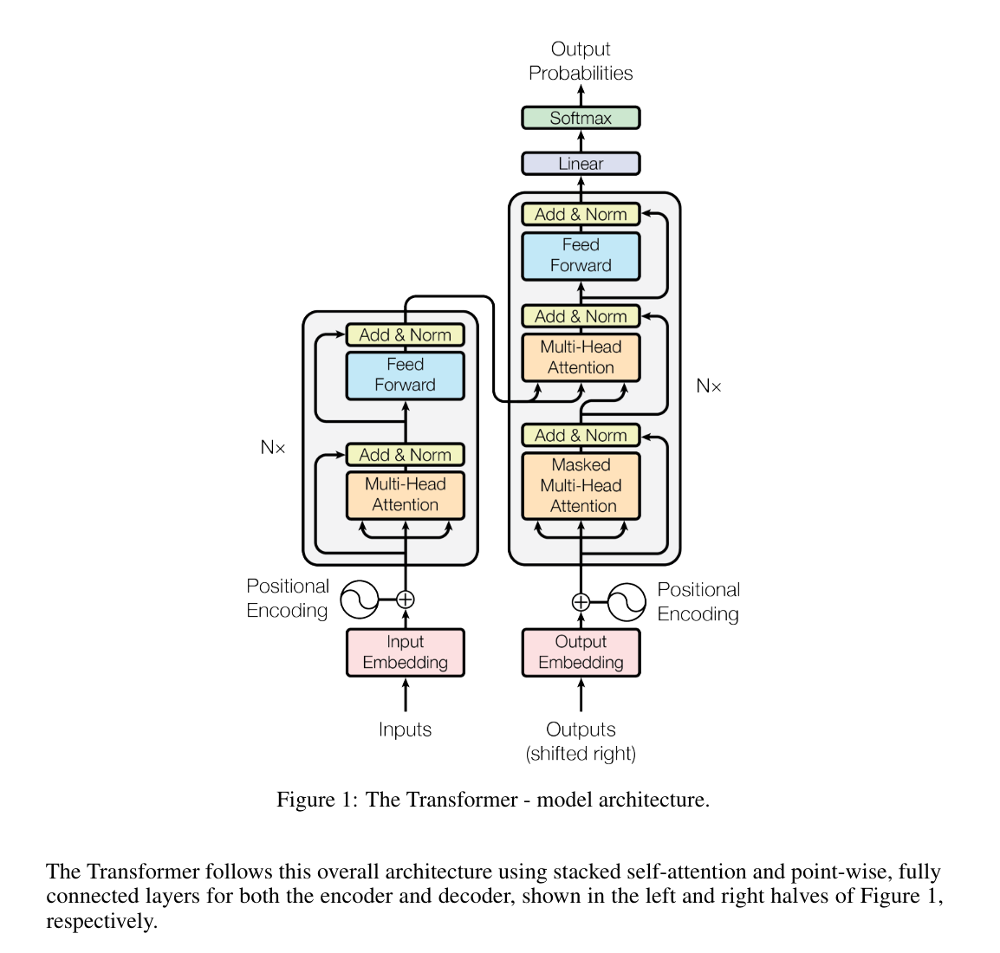

# transformer 训练教程

## 模型说明
Transformer是由Vaswani等人在2017年提出的一种网络结构，发表在论文《Attention Is All You Need》中。Transformer模型通过自注意力机制和完全并行的架构设计，解决了长序列数据的依赖问题，在机器翻译、自然语言处理等任务中表现出色，本项目中为翻译任务。

Transformer模型由编码器（Encoder）和解码器（Decoder）两部分组成，每部分由若干层堆叠而成。
Transformer的结构包括以下几部分：
1. 编码器（Encoder）：
    * 每个编码器层包括两个子层：一个多头自注意力机制（Multi-Head Self-Attention）子层和一个前馈神经网络（Feed-Forward Network）子层。
    * 在每个子层之后，使用残差连接（Residual Connection）和层归一化（Layer Normalization）。
    * 输入通过位置编码（Positional Encoding）与原始嵌入相加，以保留序列的顺序信息。
2. 解码器（Decoder）：
    * 每个解码器层包括三个子层：一个多头自注意力子层、一个多头编码器-解码器注意力子层（Multi-Head Encoder-Decoder Attention），以及一个前馈神经网络子层。
    * 同样，每个子层之后使用残差连接和层归一化。
    * 解码器在自注意力子层中采用掩码机制（Masking），以确保解码器在生成下一个词时只能使用之前生成的词。

### Transformer 网络结构介绍如下图：


### Transformer中self Attention 和 Multi-Head Attention Mechanism如下图：


### 各种大小的Transformer配置如下：

|  Model   | num_layers | hidden_size | num_head | filter_size|paramters|
|  ----  | ----  | --- | ---- | ---- | --- |
| Transformer (base)  | 6+6 | 512 | 8 | 2048 | 62M |
| Transformer (big)  | 6+6 | 512 | 16 | 4096 | 211M |


## 环境准备

* 根据《TopsRider用户使用手册》安装TopsRider软件栈
  * 软件栈安装推荐使用 HOST+Docker 形式。用户下载的 TopsInstaller 安装包中提供了 Dockerfile ，用户可在 Host OS 中完成 Docker image 的编译，详细操作参考《TopsRider用户使用手册》附录部分，完成环境的安装
  * 在使用过程中，已经默认安装了PyTorch、PaddlePaddle、Tensorflow等框架以及相关依赖，用户无需额外安装的安装包

* 完成安装后，进行运行测试。
```
import torch_gcu
torch_gcu.is_available()
```
输入上述命令，在终端输出True，则表示安装成功。
```
True
```


##  数据和模型准备：

### 数据准备

WMT14 English-German 数据集是用于机器翻译任务的标准基准数据集之一。WMT（Workshop on Statistical Machine Translation）每年都会举办翻译竞赛，WMT14数据集是2014年竞赛的数据集。该数据集包含大量的平行语料，主要用于训练、验证和测试机器翻译模型。
* 语言对：英语-德语（English-German）
* 数据量：
   * 训练集：约450万对句子
   * 验证集：约3000对句子
   * 测试集：约3000对句子
   * 数据来源：新闻文章、欧盟法律文件、联合国文件等

* 下载地址：
    https://statmt.org/wmt14/translation-task.html#Download


* 解压后的目录结构：

    ```
    |-- wmt14_en_de
    |   |-- train
    |   |-- valid
    |   |-- test
    ```

### 数据集处理：
* 参考Nvidia DeepLearningExamples处理方式：
https://github.com/NVIDIA/DeepLearningExamples/tree/master/PyTorch/Translation/Transformer

* 处理好后的目录结构：

    ```
    |-- wmt14_en_de_joined_dict
    |   |-- code
    |   |-- dict.de.txt
    |   |-- dict.en.txt
    |   |-- test.en-de.de.bin
    |   |-- test.en-de.de.idx
    |   |-- test.en-de.en.bin
    |   |-- test.en-de.en.idx
    |   |-- test.raw.de
    |   |-- train.en-de.de.bin
    |   |-- train.en-de.de.idx
    |   |-- train.en-de.en.bin
    |   |-- train.en-de.en.idx
    |   |-- valid.en-de.de.bin
    |   |-- valid.en-de.de.idx
    |   |-- valid.en-de.en.bin
    |   |-- valid.en-de.en.idx
    |   |-- valid.raw.de
    ```


## 模型训练

主要参数解释如下

   ```
--nproc_per_node=8： 每个节点使用的进程数为 8
transformer_data_pytorch_33728/wmt14_en_de_joined_dict：使用的数据集存放的目录
--share-all-embeddings： 共享源和目标的词嵌入矩阵
--no-epoch-checkpoints： 不在每个 epoch 结束时保存检查点
--device=gcu： 使用 GCU 设备
--max-tokens=18432： 每个批次的最大 token 数为 18432
--max-sentences-valid=144： 验证时每个批次的最大句子数为 144
--max-sentences=144： 训练时每个批次的最大句子数为 144
--max-epoch=40： 最大训练 epoch 数为 40
--training_step_per_epoch=-1： 每个 epoch 的评估步数（-1 表示使用全部验证数据）
--warmup-init-lr=1e-09： 预热阶段初始学习率为 1e-09
--warmup-updates=4000： 预热阶段的更新步数为 4000
--lr=0.000846： 学习率为 0.000846
--dropout=0.1： Dropout 概率为 0.1
--max-source-positions=128： 源序列的最大长度为 128
--max-target-positions=128： 目标序列的最大长度为 128
--seed=1： 随机种子设置为 1
--log-interval=200: 日志记录间隔为 200 步
--static-batch=True： 使用静态批次（每个批次的大小固定）
--save-interval-updates=20000： 每 20000 步保存一次模型
--model=transformer： 使用的模型是 Transformer
--arch=transformer_wmt_en_de_base_t2t： 使用的模型架构是 transformer_wmt_en_de_base_t2t
--save-dir=runs： 模型保存目录是 runs

   ```


### 分布式训练

   ```
LOG_TIME=$(date '+%Y%m%d%H%M%S')
LOG_FILE=enflame_distributed_8card_pytorch_transformer_convergence_${LOG_TIME}.log
python3.8 -u -m torch.distributed.launch \
    --nproc_per_node=8 \
    --master_addr=127.0.0.1 \
    --master_port=34568 \
    --use_env ./train.py \
    ${DATASET_DIR}/transformer_data_pytorch_33728/wmt14_en_de_joined_dict \
    --share-all-embeddings \
    --skip-invalid-size-inputs-valid-test \
    --no-epoch-checkpoints \
    --device=gcu \
    --device_type=gcu \
    --max-tokens=18432 \
    --max-sentences-valid=144 \
    --max-sentences=144 \
    --max-epoch=40 \
    --training_step_per_epoch=-1 \
    --eval_step_per_epoch=-1 \
    --warmup-init-lr=1e-09 \
    --warmup-updates=4000 \
    --lr=0.000846 \
    --dropout=0.1 \
    --max-source-positions=128 \
    --max-target-positions=128 \
    --seed=1 \
    --log-interval=200 \
    --static-batch=True \
    --log-get-freq=20 \
    --skip-steps=5 \
    --save-interval-updates=20000 \
    --model=transformer \
    --arch=transformer_wmt_en_de_base_t2t \
    --stat-file=DGX1_fp32_static_gcu.json \
    --save-dir=runs 2>&1 | tee ${LOG_FILE}

   ```

## 评估模型结果

   ```
LOG_TIME=$(date '+%Y%m%d%H%M%S')
EVAL_LOG_FILE=enflame_distributed_8card_pytorch_transformer_evaluate_${LOG_TIME}.log
python3 -u ./eval_dtu_ckpt.py \
   ${DATASET_DIR}/transformer_data_pytorch_33728/wmt14_en_de_joined_dict \
   --share-all-embeddings \
   --lr-scheduler inverse_sqrt \
   --warmup-init-lr 1e-9 \
   --warmup-updates 4000 \
   --lr 0.002 \
   --dropout 0.1 \
   --max-tokens 12288 \
   --max-sentences-valid 40 \
   --max-sentences 40 \
   --max-source-positions 128 \
   --max-target-positions 128 \
   --skip-invalid-size-inputs-valid-test \
   --seed 1 \
   --max-epoch 15 \
   --no-epoch-checkpoints \
   --device_type gcu \
   --log-interval 100 \
   --static-batch True \
   --skip-steps 2 \
   --save-dir ./runs \
   --stat-file DGX1_fp32_static_gcu.json 2>&1|tee ${EVAL_LOG_FILE}
   ```


## 训练结果
下面是8卡分布式训练的report：
   ```
{
    "model": "transformer",
    "batch_size": 144,
    "local_rank": 0,
    "epochs": 1,
    "training_step_per_epoch": 13000,
    "eval_step_per_epoch": 13000,
    "device": "gcu",
    "skip_steps": 5,
    "train_fps_mean": xxx,
    "train_fps_min": xxx,
    "train_fps_max": xxx,
    "training_time": xxx
}

   ```
说明： 由于深度学习的训练存在随机性，训练结果可能存在一定差异。