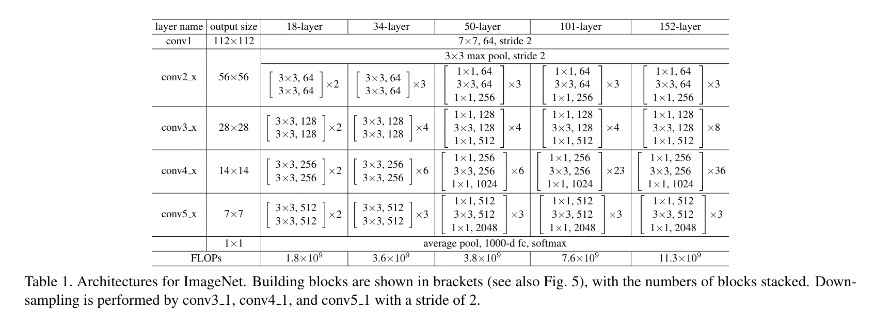

# Resnet50 训练教程

## 模型说明
ResNet是何凯明大神在2015年提出的一种网络结构，获得了ILSVRC-2015分类任务的第一名，同时在ImageNet detection，ImageNet localization，COCO detection和COCO segmentation等任务中均获得了第一名，在当时可谓是轰动一时。

ResNet又名残差神经网络，指的是在传统卷积神经网络中加入残差学习（residual learning）的思想，解决了深层网络中梯度弥散和精度下降（训练集）的问题，使网络能够越来越深，既保证了精度，又控制了速度。

各种大小的ResNet结构如下：



## 环境准备

* 根据《TopsRider用户使用手册》安装TopsRider软件栈
  * 软件栈安装推荐使用 HOST+Docker 形式。用户下载的 TopsInstaller 安装包中提供了 Dockerfile ，用户可在 Host OS 中完成 Docker image 的编译，详细操作参考《TopsRider用户使用手册》附录部分，完成环境的安装
  * 在使用过程中，已经默认安装了PyTorch、PaddlePaddle、Tensorflow等框架以及相关依赖，用户无需额外安装的安装包

* 完成安装后，进行运行测试。
```
import torch_gcu
torch_gcu.is_available()
```
输入上述命令，在终端输出True，则表示安装成功。
```
True
```


##  数据和模型准备：

### 数据准备

ImageNet图像数据集始于2009年，当时李飞飞教授等在CVPR2009上发表了一篇名为《ImageNet: A Large-Scale Hierarchical Image Database》的论文，之后就是基于ImageNet数据集的7届ImageNet挑战赛(2010年开始)，2017年后，ImageNet由Kaggle(Kaggle公司是由联合创始人兼首席执行官Anthony Goldbloom 2010年在墨尔本创立的，主要是为开发商和数据科学家提供举办机器学习竞赛、托管数据库、编写和分享代码的平台)继续维护。

训练模型之前必须先下载数据集，这里使用的是ImageNet，该数据集包含1000个对象1,281,167张图片。

* 下载地址：
    https://image-net.org/download-images


* 解压后的目录结构：

    ```
    |-- imagenet
    |   |-- ILSVRC2012_img_train.tar.gz
    |   |-- ILSVRC2012_img_val.tar.gz
    |   |-- ILSVRC2012_devkit_t12.tar
    ```

### 数据集处理：
* 参考Nvidia DeepLearningExamples处理方式：
https://github.com/NVIDIA/DeepLearningExamples/blob/master/PyTorch/Classification/ConvNets/resnet50v1.5/README.md

* 处理好后的目录结构：

    ```
    |-- imagenet
    |   |-- train
    |   |-- train_list.txt
    |   |-- val
    |   |-- val_list.txt
    |   |-- val_map.txt
    |   |-- valprep.sh
    ```


## 模型训练

主要参数解释如下

   ```
python: 运行 Python 脚本的命令。
-u: 表示不缓冲输出，即实时显示输出信息。
./train.py: 要运行的 Python 训练脚本的文件路径。
--device=gcu: 指定使用的设备。
--batch-size=256: 每次训练的批量大小为 256。
--epochs=90: 总共进行 90 个周期的训练。
--training_step_per_epoch=-1: 每个周期中训练步骤的数量，-1 表示使用默认值。
--eval_step_per_epoch=-1: 每个周期中评估步骤的数量，-1 表示使用默认值。
--lr-schedule=step: 学习率的调度方式，这里是使用步长调度。
--num_classes=1000: 数据集中的类别数量，这里是 1000。
--model=resnet50: 要训练的模型架构，这里是 ResNet-50。
--workers=32: 数据加载时使用的工作进程数。
--print-freq=20: 每隔多少步打印一次训练信息。
--data-path=./imagenet_raw: 数据集的路径，这里是 ImageNet 数据集的路径。
--output-dir=output: 模型训练结果的输出目录。

   ```


### 分布式训练

   ```
LOG_TIME=$(date '+%Y%m%d%H%M%S')
LOG_FILE=enflame_distributed_8card_pytorch_resnet50_convergence_efp_${LOG_TIME}.log
python -u -m torch.distributed.launch\
    --nproc_per_node=8 \
    --master_addr=127.0.0.1 \
    --master_port=34568 \
    --use_env --no_python  \
    python -u ./train.py \
    --device=gcu  \
    --batch-size=256 \
    --epochs=90 \
    --training_step_per_epoch=-1 \
    --eval_step_per_epoch=-1 \
    --lr-schedule=step \
    --num_classes=1000 \
    --model=resnet50 \
    --workers=32 \
    --print-freq=20 \
    --skip_steps=5 \
    --data-path="./imagenet_raw" \
    --output-dir=output \
    2>&1 | tee ${LOG_FILE}

   ```

## 训练结果
下面是8卡分布式训练的report：
   ```
  {
    "model": "resnet50",
    "local_rank": 0,
    "batch_size": 256,
    "epochs": 90,
    "training_step_per_epoch": -1,
    "eval_step_per_epoch": -1,
    "acc1_best": 75.8639999609375,
    "acc5_best": 92.7140000390625,
    "device": "gcu",
    "skip_steps": 5,
    "train_fps_mean": xxx,
    "train_fps_min": xxx,
    "train_fps_max": xxx,
    "training_time": "xxx"
}

   ```
说明： 由于深度学习的训练存在随机性，训练结果可能存在一定差异。